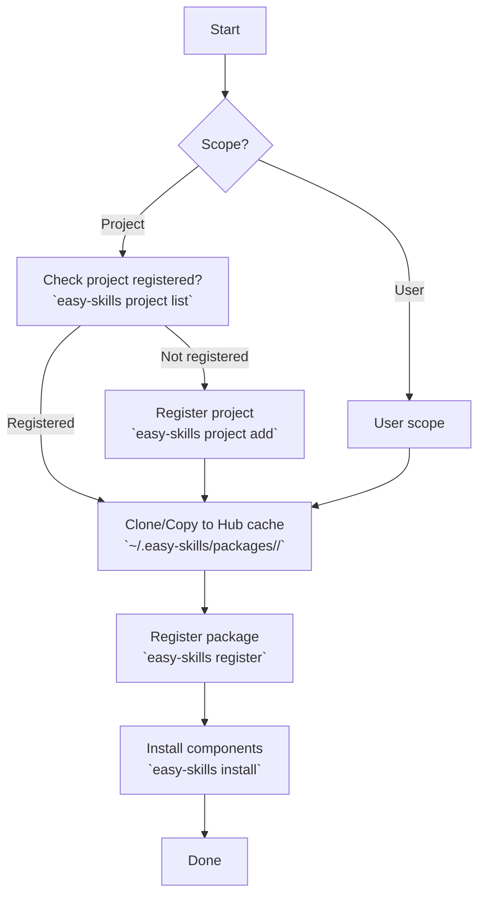

# Easy Skills

Manage packages and components (skills, agents, hooks, rules) for **Qoder** using the `easy-skills` CLI.

---

## 🚨 MANDATORY RULE

**ALL package/component installations MUST go through easy-skills.**

This applies to:
- **Skills** - Agent skill packages
- **Agents** - AI agent configurations
- **Hooks** - Pre/post execution hooks
- **Rules** - Coding rules and patterns
- **Any** files installed to Qoder

**Direct file copying is forbidden.**

---

## Installation Flow



---

## Step-by-Step Guide

### Step 1: Choose Scope

```bash
# User scope - available to all projects
--scope user

# Project scope - available to specific project
--scope project
```

### Step 2: For Project Scope - Check Project Registration

```bash
# List registered projects
easy-skills project list

# If not registered, add it
easy-skills project add --name <project-name> --path /path/to/project
```

### Step 3: Clone/Copy to Hub Cache

```bash
# Create Hub cache directory
mkdir -p ~/.easy-skills/packages

# Clone package to Hub cache
git clone <git-url> ~/.easy-skills/packages/<package-name>
```

### Step 4: Register Package

```bash
easy-skills register \
  --name <package-name> \
  --target qoder \
  --source ~/.easy-skills/packages/<package-name>
```

### Step 5: Install to Qoder

```bash
# User scope
easy-skills install --name <package-name> --target qoder --ide qoder --scope user

# Project scope
easy-skills install --name <package-name> --target qoder --ide qoder --scope project
```

---

## Hub Cache Directory

```
~/.easy-skills/packages/<package-name>/
```

This is the **ONLY** acceptable source path for `--source`.

---

## Atomic Operations

| Command | Action |
|---------|--------|
| `register` | Registers package **AND** components together |
| `install` | Copies files to IDE |
| `uninstall` | Removes files from IDE **AND** deletes installation records |

---

## Complete Command Reference

### Install

```bash
easy-skills install --name <name> --target qoder --ide qoder --scope user
easy-skills install --name <name> --target qoder --ide qoder --scope project
```

### Uninstall

```bash
easy-skills uninstall --name <name> --target qoder --ide qoder --scope user
```

### Reinstall

```bash
easy-skills reinstall --name <name> --target qoder --ide qoder
```

### Register

```bash
easy-skills register --name <name> --target qoder --source ~/.easy-skills/packages/<name>
```

### List & Info

```bash
easy-skills list --target qoder
easy-skills info --name <name> --target qoder
easy-skills status --ide qoder
```

### Project Management

```bash
easy-skills project list
easy-skills project add --name <name> --path <path>
easy-skills project remove --name <name>
```

---

## Output Format

```json
{
  "success": true,
  "data": {...}
}
```

On error:

```json
{
  "success": false,
  "error": "error message"
}
```

---

## Web UI

View status at: http://localhost:27842

Start server: `easy-skills serve`
